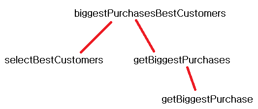
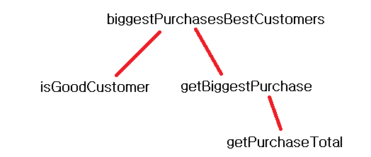

# 1. Intro

계산이 더 복잡해지면 함수형 도구 하나로 작업할 수 없다. 이 장에서는 여러 단계를 하나로 엮은 체인(chain)으로 복합적인 계산을 표현하는 방법을 살펴본다.

(내 데이터 추출 코드 중에 부동소수점 쪽 chaining)

(gopax 코드 중에 mergeMap)

# 2. 체이닝(chainning)

> 1. 우수 고객(3개 이상 구매)을 거른다. (filter)
> 2. ~~우수 고객을 가장 비싼 구매로 바꾼다. (map) -> ?~~
> 2. 우수 고객의 구매 목록 중 가장 비싼 구매를 구한다. (map)

```js
function biggestPurchasesBestCustomers(customers) {
    // 1단계
    var bestCustomers = filter(customers, function(customer) {
        return customer.purchases.length >= 3;
    });

    // 2단계
    var biggestPurchases = map(bestCustomers, function(customer) {
        return reduce(customer.purchases, {total: 0}, function(biggestSoFar, purchase) {
            if(biggestSoFar.total > purchase.total)
                return biggestSoFar;
            else
                return purchase;
        });
    });

    return biggestPurchases;
}
```

중첩된 콜백은 읽기 어렵다.

```js
function biggestPurchasesBestCustomers(customers) {
    var bestCustomers = filter(customers, function(customer) {
        return customer.purchases.length >= 3;
    });

    var biggestPurchases = map(bestCustomers, function(customer) {
        return maxKey(customer.purchases, {total: 0}, function(purchase) {
            return purchase.total;
        });
    });

    return biggestPurchases;
}

function maxKey(array, init, f) {
    return reduce(
            array,
            init,
            function(biggestSoFar, element) {
                if(f(biggestSoFar) > f(element)
                    return biggestSoFar;
                else
                    return element;
            });    
}
```

중첩된 리턴은 읽기 어렵다.

### A. 체인을 명확하게 만들기 1: 단계에 이름 붙이기

각 단계의 고차 함수를 빼내 이름을 붙인다.

```js
function biggestPurchasesBestCustomers(customers) {
    var bestCustomers = selectBestCustomers(customers);
    var biggestPurchases = getBiggestPurchases(bestCustomers);

    return biggestPurchases;
}

function selectBestCustomers(customers) {
    return filter(customers, function(customer) {
        return customer.purchases.length >= 3;
    });
}

function getBiggestPurchases(customers) {
    return map(customers, getBiggestPurchase);
}

function getBiggestPurchase(customer) {
    return maxKey(customer.purchases, {total: 0}, function(purchase) {
        return purchase.total;
    });
}
```

각 단계에 이름을 붙이면 훨씬 명확해진다.  
콜백 함수는 여전히 인라인으로 사용하고 있다. 또 인라인으로 정의된 콜백 함수는 재사용할 수 없다.  



### B. 체인을 명확하게 만들기 2: 콜백에 이름 붙이기

단계에 이름을 붙이는 대신 콜백을 빼내 이름을 붙이자.

```js
function biggestPurchasesBestCustomers(customers) {
    var bestCustomers = filter(customers, isGoodCustomer);
    var biggestPurchases = map(bestCustomers, getBiggestPurchase);

    return biggestPurchases;
}

function isGoodCustomer(customer) {
    return customer.purchases.length >= 3;
}

function getBiggestPurchase(customer) {
    return maxKey(customer.purchases, {total: 0}, getPurchasesTotal);
}

function getPurchaseTOtal(purchase) {
    return purchase.total;
}
```


 
 - 호출 그래프

콜백에 이름 붙이는 방법이 더 명확하다. 그리고 재사용하기도 좋다. 인라인 대신 이름을 붙여 콜백을 사용하면 단계가 중첩되는 것도 막을 수 있다.

# 3. 비효율적이야, 최적화해보자

filter와 map은 모두 새로운 배열을 만든다. 함수가 호출될 때마다 새로운 배열이 생기기 떄문에 크기가 클 수도 있다. 비효율적이라고 생각할 수 있지만, 대부분 문제가 되지 않는다. 만들어진 배열이 필요없을 때 가비지 컬렉터가 빠르게 처리하기 때문이다.

그럼에도 불구하고 비효율적인 경우가 있다. 그럴 때는 스트림 결합(stream fusion)을 통해 map과 filter, reduce 체인을 최적화한다.

> 처음부터 stream fusion을 통해 복잡하게 작성할 필요는 없어보인다.
> 정말 최적화가 필요한 경우에 이런 방법이 있다는 것을 인지하고 적용할 수 있을 정도로만 알고 있으면 될 듯 하다.

### A. map()

```js
var names = map(customers, getFullName);
var nameLengths = map(names, stringLength);
```

```js
var nameLengths = map(customers, function(customer) {
    return stringLength(getFullName(customer));
});
```

### B. filter()

```js
var goodCustomers = filter(customers, isGoodCustomer);
var withAddresses = fulter(goodCustomers, hasAddress);
```

```js
var withAddresses = filter(customers, function(customer) {
    return isGoodCustomer(customer) && hasAddress(customer);
});
```

### C. reduce()

```js
var purchaseTotals = map(purchases, getPurchaseTotal);
var purchaseSum = reduce(purchaseTotals, 0, plus);
```

```js
var purchaseSum = reduce(purchases, 0, function(total, purchase) {
    return total + getPurchaseTotal(purchase);
});
```

# 4. 체이닝 팁 요약

### A. 데이터 만들기

함수형 도구는 배열 전체를 다룰 때 잘 동작한다. 배열 일부에 대해 동작하는 반복문이 있다면 배열 일부를 새로운 배열로 나눌 수 있다. 그리고 map(), filter(), reduce() 같은 함수형 도구를 사용하면 작업을 줄일 수 있다.

### B. 배열 전체를 다루기

map()은 모든 항목을 변환하고 filter()는 항목을 없애거나 유지한다. reduce()는 항목을 하나로 합친다.

### C. 작은 단계로 나누기

작은 단계는 더 단순하기 때문에 두 개 이상의 단계로 나눠라. 작은 단계가 만들려는 목적에 얼마나 가까운지 생각해보라.

### D. 보너스

- 조건문을 filter()로 바꾸기
- 유용한 함수로 추출하기
- 개선을 위해 실험하기

# 5. 체이닝 디버깅을 위한 팁

### A. 구체적인 것을 유지하기

변수명의 의미를 기억하기 쉽게 이름을 붙여라.

### B. 출력해보기

각 단계 사이에 print 구문을 넣어 코드를 돌려라. ..?

### C. 타입을 따라가 보기

자바스크립트처럼 타입이 없는 언어를 사용해도 함수형 도구는 정확한 타입이 있다. 각 단계를 지나는 값의 타입을 따라가 보라.

# 6. 다양한 함수형 도구

### A. pluck()

map()으로 특정 필드값을 가져오기 위해 콜백을 매번 작성하는 것은 번거롭다. pluck()을 사용하면 매번 작성하지 않아도 된다.

```js
function pluck(array, field) {
    return map(array, function(object) {
        return object[field];
    });
}
```

```js
var prices = pluck(products, 'prices');
```

### B. concat()

concat()으로 배열 안에 배열을 뺼 수 있다. ...??  

중첩된 배열을 한 단계의 배열로 만든다.

```js
function concat(arrays) {
    var ret = [];
    forEach(arrays, function(array) {
        forEach(array, function(element) {
            ret.push(element);
        });
    });
    return ret;
}
```

```js
var purchaseArrays = pluck(customers, "purchases");
var allPurchases = concat(purchaseArrays);
```

### C. frequenciesBy()와 groupBy()

개수를 세거나 그룹화하는 일은 종종 쓸모가 있다.

```js
function frequenciesBy(array, f) {
    var ret = {};
    forEach(array, function(element) {
        var key = f(element);
        if(ret[key]) ret[key] += 1;
        else         ret[key] = 1;
    });
    return ret;
}
```

```js
var howMany = frequenciesBy(products, function(p) {
    return p.type;
});

> console.log(howMany['ties'])
4
```

---

```js
function groupBy(array, f) {
    var ret = {};
    forEach(array, function(element) {
        var key = f(element);
        if(ret[key]) ret[key].push(element);
        else         ret[key] = [element];
    });
    return ret;
}
```

```js
var groups = groupBy(range(0,  10), isEven);

> console.log(groups)
{
    true: [0, 2, 4, 6, 8],
    false: [1, 3, 5, 7, 9]
}
```

# 7. 더 편리한 자바스크립트

1. map(), filter(), reduce()가 내장 함수이기 때문에 직접 만들지 않아도 된다.
2. 이 함수들이 배열의 메서드이기 때문에 쓰기 쉽다.

```js
var customerNames = customers.map(function(c) {
    return c.firstName + " " + c.lastName;
});
```

자바스크립트에 있는 함수형 도구는 메서드이기 떄문에 체이닝 할 때 중간 변수에 할당하지 않고 이어서 쓸 수 있다.

```js
var window = 5;

var answer = range(0, array.length)
        .map(function(i) {
            return array.slice(i, i + window);
        })
        .map(average);
```

자바스크립트에는 인라인 함수를 정의하는 편리한 문법이 있다.

```js
var window = 5;

var answer = range(0, array.length)
        .map(i => array.slice(i, i + window))
        .map(average);
```

자바스크립트 map()과 filter()는 element와 index를 함께 전달할 수 있다.

```js
var answer = array
                .map((e, i) => array.slice(i, i + window))
                .map(average);
```

# 8. 값을 만들기 위한 reduce()

reduce()의 또 다른 용도는 값을 만드는 것이다.

e.g) 고객이 장바구니를 잃어버렸지만, 고객이 장바구니에 추가한 제품을 모두 배열로 로깅하고 있었다. 그렇다면, 이 정보에 장바구니 정보를 얻을 수 있지 않을까?

위 경우가 reduce()를 쓰기 좋은 상황이다. **배열을 반복하면서 값을 하나로 만드는 일**

reduce()의 첫 번째 인자는 항목 배열이므로 **로그 배열**을 넘긴다.  
두 번째 인자는 초기값이다. 장바구니 객체는 처음에는 빈 객체로 시작해야 한다.  
세번쨰 인자는 콜백 함수인데, 콜백 함수의 첫 번째 인자는 리턴값과 같은 장바구니고 두 번째 인자는 배열에 들어 있는 제품 이름이다.

```js
reduce(itemsAdded, {}, addOne);

function addOne(cart, item) {
    if(!cart[item])
        return add_item(cart, {name: item, quantity: 1, price: priceLookup(item)});
    else {
        var quantity = cary[item].quantity;
        return setFieldByName(cart, item, 'quantity', quantity + 1);
    }
}
```

고객이 장바구니에 제품을 추가한 기록이 모두 있어서 어느 시점의 장바구니라도 만들 수 있다. 모든 시점의 장바구니를 만들지 않아도 로그를 이용해 어느 시점의 장바구니라도 다시 만들 수 있다.

함수형 프로그래밍에서 중요한 기술이다. 고객이 장바구니에 추가한 제품을 배열 형태로 기록한다고 생각해보세요. 되돌리기는 어떻게 구현할 수 있을까요? 배열에서 마지막 항목만 없애면 된다.

관심이 있다면, **이벤트 소싱(event sourcing)**에 대해 찾아보세요.

고객이 제품을 추가했는지 삭제했는지 알려주는 값과 제품에 대한 값을 함께 기록하면 고객이 제품을 삭제한 경우도 처리할 수 있다.

```js
var itemOps = [['add', "shirt"], ["remove', "shirt"]];

var shoppingCart = reduce(itemOps, {}, function(cart, itemOp) {
    var op = itemOp[0];
    var item = itemOp[1];

    if(op === 'add') return addOne(cart, item);
    if(op === 'remove') return removeOne(cart, item);
});

function removeOne(cart, item){
    if(!cart[item])
        return cart;
    else {
        var quantity = cart[item].quantity;
        if(quantity === 1)
            return remove_item_by_name(cart, item);
        else
            return setFieldByName(cart, item, 'quantity', quantity - 1);
    }
}
```

배열에 동작 이름과 제품 이름인 인자를 넣어 동작을 완전한 데이터로 표현했다. 인자를 데이터로 만들면 함수형 도구를 체이닝하기 좋다.


### A. 이벤트 소싱 (event sourcing) [1]

도메인 주도 설계(domain-driven design, DDD) 커뮤니티에서 개발한 기법이다.

이벤트 소싱은 변경 데이터 캡처(change data capture)와 유사하게 애플리케이션 상태 변화를 모두 변경 이벤트 로그로 저장한다. CDC와 가장 큰 차이점은 이 아이디어를 적용하는 추상화 레벨이 다르다는 점이다.

이벤트 소싱에서 애플리케이션 로직은 이벤트 로그에 기록된 불편 이벤트를 기반으로 명시적으로 구축한다. 이때 이벤트 저장은 단지 추가만 가능하고 갱신이나 삭제는 권장하지 않거나 금지한다. 이벤트는 저수준에서 상태 변경을 반영하는 것이 아니라 애플리케이션 수준에서 발생한 일을 반영하게끔 설계됐다.

[trade_history sample]

> 여기부터는 상상을 해봤습니다.

이때 기록된 로그는 insert만 가능하다. 이는 시계열에 따라 incremental update가 가능하다는 의미이고 airflow에서 backfill이 가능하다는 의미이다.

# 9. 메소드 연산자로 정렬하기

점으로 나열된 긴 줄은 함수형 도구를 잘 연결해 쓰고 있다는 뜻이다. 또 긴 줄은 많은 단계가 있다는 말이고 가장 위로 데이터가 들어와 가장 아래로 나가는 파이프라인으로 읽을 수 있다.

```js
function movingAverage(numbers) {
    return numbers
            .map((_e, i) => nu mumbers.slice(i, i + window))
            .map(average);
}
```

# 999. 참고문헌

[1] Martin Kleppmann. Designing Data-Intensive Applications. p454. wikibooks. 2021